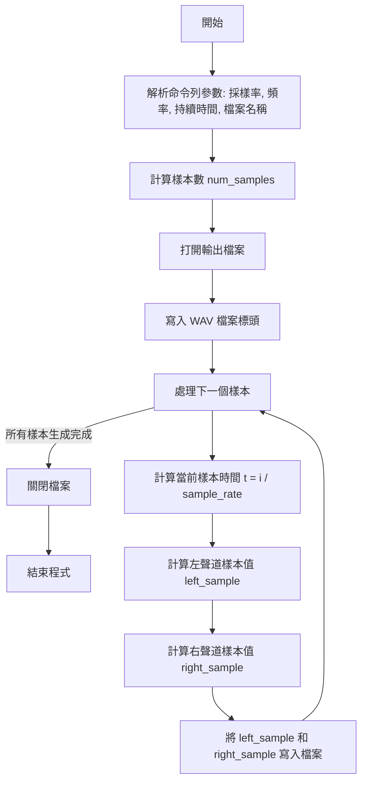
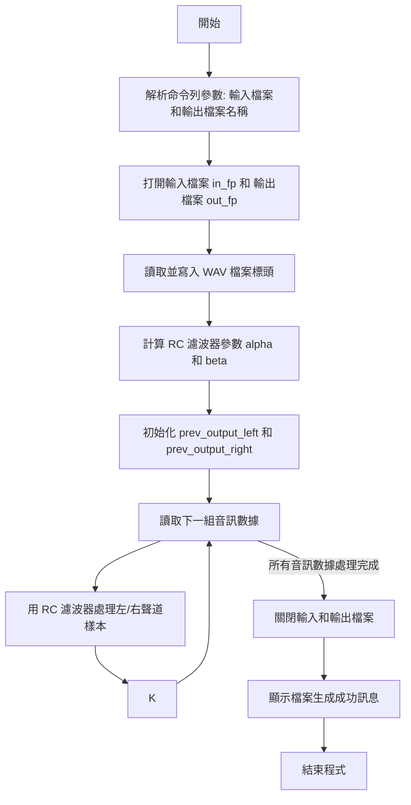

# DSP Assignment-1
Simulation of RC Low-Pass Filter by Discrete Signal Processing

hackmd：https://hackmd.io/@9KvvH16wQKCNkiQnydFUsQ/DSP_Assignment_1

## 學習目標
1. 了解Linear Constant-Coefficient Difference Equation (LCCDE) 的由來以及原理
2. 對於 Sampling Rate 有初步的認識
3. 了解怎麼由連續時間的處理轉變成離散信號的處理
4. 練習以 C 語言撰寫 filter
5. 使用 Python 繪製波形

## **Problem 1**
### **題目**
If $x(t) = e^{j \Omega t}$ ,find $y(t)$ .Nont that $y(t)$ can be expressed by $y(t) = H(\Omega) e^{j \Omega t}$ where $H(\Omega)$ is a function of $\Omega$ with parameters of $R$ and $C$ .

### **解題步驟**
根據題意，假設 $x(t) = e^{j \Omega t}$ ，要找 $y(t)$：
$$
y(t) = H(\Omega) e^{j \Omega t} \tag{1-1}
$$
先求 $H(\Omega)$

由題目的 `eq.(3)` 可以知道：
$$
X(t) = RC \frac{d y(t)}{d t} + y(t) \tag{1-2}
$$

將 $x(t) = e^{j \Omega t}$ 和 $y(t) = H(\Omega) e^{j \Omega t}$ 帶入方程式：
$$
e^{j \Omega t} = RC \frac{d}{dt} \left( H(\Omega) e^{j \Omega t} \right) + H(\Omega) e^{j \Omega t} \tag{1-3}
$$

先求 $\frac{d}{dt} \left( H(\Omega) e^{j \Omega t} \right)$：
$$
\frac{d}{dt} \left( H(\Omega) e^{j \Omega t} \right) = H(\Omega) \cdot j \Omega e^{j \Omega t} \tag{1-4}
$$

再將算出來的 $\frac{d}{dt} \left( H(\Omega) e^{j \Omega t} \right)$ 帶回 `eq.(1-3)` 可以得到：
$$
e^{j \Omega t} = RC \cdot H(\Omega) \cdot j \Omega e^{j \Omega t} + H(\Omega) e^{j \Omega t} \tag{1-5}
$$

因為兩邊都有 $e^{j \Omega t}$，可以消去，最後得到：
$$
1 = (RC \cdot j \Omega + 1) H(\Omega) \tag{1-6}
$$

最後化簡之後可以得到 $H(\Omega)$ ：
$$
H(\Omega) = \frac{1}{RC \cdot j \Omega + 1} \tag{1-7}
$$

帶回 $y(t) = H(\Omega) e^{j \Omega t}$ 得到：
$$
y(t) = \frac{e^{j \Omega t}}{RC \cdot j \Omega + 1} \tag{1-8}
$$
   
---

### 手寫過程


## **Problem 2**
### **題目**
If $x(t) = e^{j\Omega t}u(t)$ , where $u(t)$ is the unit step function, find $y(t)$ .Note that $y(t)$ can be expressed by a transient-state response and a steady-state response.

### **解題步驟**
根據題意，假設 $x(t) = e^{j\Omega t}u(t)$ ，要找 $y(t)$

如果設 $x(t) = \delta(t)$ ，則可以表達為：
$$
\delta(t) = RC \frac{d}{dt}h(t) + h(t) \tag{2-1}
$$

將 `eq.(2-1)` 進行 Laplace Transform $\mathcal{L}\{h(t)\}$ ，假設初始條件為零：
$$
1 = (RC \cdot s + 1) H(s) \tag{2-2}
$$
得到 $H(s)$ ：
$$
H(s) = \frac{1}{RC \cdot s + 1} \tag{2-3}
$$

之後再轉回去 得到 $h(t)$ ：
$$
\mathcal{L}^{-1} \{H(s)\} \Rightarrow h(t) = \frac{1}{RC} e^{-\frac{1}{RC}t} u(t) \tag{2-4}
$$

因為 $y(t) = x(t) * h(t)$ ，則：
$$
y(t) = \int_{0}^{t} h(\tau) e^{j\Omega (t - \tau)} d\tau \tag{2-5}
$$

代入 `eq.(2-4)` 可以得到：
$$
y(t) = \int_{0}^{t} \frac{1}{RC} e^{-\frac{\tau}{RC}} e^{j\Omega (t - \tau)} d\tau \tag{2-6}
$$

可以提出 $e^{j\Omega t}$ 項：
$$
y(t) = \frac{1}{RC} e^{j\Omega t} \int_{0}^{t} e^{-\left(\frac{1}{RC} + j\Omega \right) \tau} d\tau \tag{2-7}
$$

計算積分項，得到 $y(t)$ ：
$$
y(t) = \frac{1}{RC} e^{j\Omega t} \times \frac{1 - e^{-\left(\frac{1}{RC} + j\Omega \right)t}}{\frac{1}{RC} + j\Omega} \tag{2-8}
$$

---

### 手寫過程


## **Problem 3**
### **題目**
If $x(t) = e^{j\Omega t}$ , $R = 1000\Omega$ ,and $C = \left(\frac{1}{2\pi} \times \frac{1}{400} \times \frac{1}{1000}\right)$ ,find $y(t)$ . for $\Omega = 2\pi \cdot f$ , $f = 100\text{Hz}, 400\text{Hz},$ and $3000\text{Hz}$ .

### **解題步驟**
已知
- $R = 1000 \Omega$
- $C = \frac{1}{2\pi \times 400 \times 1000}$
- $y(t) = \frac{e^{j\Omega t}}{RC \cdot j\Omega + 1}$

(1) 當 $f = 100$ Hz時：

計算 $\Omega = 2\pi \cdot f = 2 \pi \times 100 = 200\pi$

$\Omega$ 代入 $(t)$ ：
$$
y(t) = \frac{e^{j200\pi t}}{1000 \cdot \frac{1}{800000\pi} \cdot j200\pi + 1} \tag{3-1}
$$
簡化後得到：
$$
y(t) = \frac{e^{j200\pi t}}{0.25j + 1} \tag{3-2}
$$
$$
y(t) = \frac{4e^{j200\pi t}}{j + 4} \tag{3-3}
$$

(2) 當 $f = 400$ Hz時：

計算 $\Omega = 2\pi \cdot f = 2 \pi \times 400 = 800\pi$

$\Omega$ 代入 $(t)$ ：
$$
y(t) = \frac{e^{j800\pi t}}{1000 \cdot \frac{1}{800000\pi} \cdot j800\pi + 1} \tag{3-4}
$$
簡化後得到：
$$
y(t) = \frac{e^{j800\pi t}}{j + 1} \tag{3-5}
$$

(3) 當 $f = 3000$ Hz時：

計算 $\Omega = 2\pi \cdot f = 2 \pi \times 3000 = 6000\pi$

$\Omega$ 代入 $(t)$ ：
$$
y(t) = \frac{e^{j6000\pi t}}{1000 \cdot \frac{1}{800000\pi} \cdot j6000\pi + 1} \tag{3-6}
$$
簡化後得到：
$$
y(t) = \frac{e^{j6000\pi t}}{7.5j + 1} \tag{3-7}
$$
$$
y(t) = \frac{2e^{j6000\pi t}}{15j + 2} \tag{3-8}
$$

---

### 手寫過程


## **Problem 4**
### **題目**
If $x(t) = e^{j\Omega t}u(t)$ , $R = 1000\Omega$ ,and $C = \left(\frac{1}{2\pi} \times \frac{1}{400} \times \frac{1}{1000}\right)$ ,find $y(t)$ . for $\Omega = 2\pi \cdot f$ , $f = 100\text{Hz}, 400\text{Hz},$ and $3000\text{Hz}$ .

### **解題步驟**
已知
- $R = 1000 \Omega$
- $C = \frac{1}{2\pi \times 400 \times 1000}$
- $y(t) = \frac{1}{RC} e^{j\Omega t} \times \frac{1 - e^{-\left(\frac{1}{RC} + j\Omega\right)t}}{\frac{1}{RC} + j\Omega}$

(1) 當 $f = 100 Hz$ 時：

計算 $\Omega = 2\pi \cdot f = 2 \pi \times 100 = 200\pi$

$\Omega$ 代入 $y(t)$ ：
$$
y(t) = 800\pi e^{j200\pi t} \left( \frac{1 - e^{-(800\pi + j200\pi)t} }{800\pi + 200\pi j}\right) \tag{4-1}
$$
簡化後得到：
$$
y(t) = 4 e^{j200\pi t} \left( \frac{1 - e^{-(800\pi + 200\pi j) t}}{4 + j} \right) \tag{4-2}
$$
$$
y(t) = \frac{4 e^{j200\pi t} - 4 e^{-800\pi t}}{4 + j} \tag{4-3}
$$

(2) 當 $f = 400 Hz$ 時：

計算 $\Omega = 2\pi \cdot f = 2 \pi \times 400 = 800\pi$

$\Omega$ 代入 $y(t)$ ：
$$
y(t) = 800\pi e^{j800\pi t} \left( \frac{1 - e^{-(800\pi + j800\pi)t} }{800\pi + 800\pi j}\right) \tag{4-4}
$$
簡化後得到：
$$
y(t) = e^{j800\pi t} \left( \frac{1 - e^{-(800\pi + 800\pi j) t}}{1 + j} \right) \tag{4-5}
$$
$$
y(t) = \frac{e^{j800\pi t} - e^{-800\pi t}}{1 + j} \tag{4-6}
$$

(3) 當 $f = 3000 Hz$ 時：

計算 $\Omega = 2\pi \cdot f = 2 \pi \times 3000 = 6000\pi$

$\Omega$ 代入 $y(t)$ ：
$$
y(t) = 800\pi e^{j6000\pi t} \left( \frac{1 - e^{-(800\pi + j6000\pi)t} }{800\pi + 6000\pi j}\right) \tag{4-7}
$$
簡化後得到：
$$
y(t) = 2 e^{j6000\pi t} \left( \frac{1 - e^{-(800\pi + 6000\pi j) t}}{2 + 15j} \right) \tag{4-8}
$$
$$
y(t) = \frac{2 e^{j6000\pi t} - 2 e^{-800\pi t}}{2 + 15j} \tag{4-9}
$$

---

### 手寫過程


## **Problem 5**
### **題目**
If $x[n] = e^{j\omega n}$ , please find the corresponding $y[n] = H(\omega)e^{j\omega n}$ for eq.(8) with sampling rates of 4000Hz, 8000Hz, and 16000Hz.
### **解題步驟**
根據題意，假設 $x(t) = e^{j\Omega t}$ ，則 $y[n] = H(\omega) e^{j\omega n}$

由題目的 `eq.(8)` 可以知道：
$$
y[n] = \frac{RC}{RC + \tau} y[n-1] + \frac{\tau}{\tau + RC} x[n] \tag{5-1}
$$
代入 $x(t)$ , $y(t)$ 得到：
$$
H(\omega) e^{j\omega n} = \frac{RC}{RC + \tau} H(\omega) e^{j\omega(n-1)} + \frac{\tau}{\tau + RC} e^{j\omega n} \tag{5-2}
$$
消掉 $e^{j\omega n}$ ，並將 $H(\omega)$ 項整理到等號右側：
$$
H(\omega) - \frac{RC}{RC + \tau} e^{-j\omega} H(\omega) = \frac{\tau}{\tau + RC} \tag{5-3}
$$
可以得到 $H(\omega)$ ：
$$
H(\omega) = \frac{\frac{\tau}{\tau + RC}}{1 - \frac{RC}{RC + \tau} e^{-j\omega}} \tag{5-4}
$$
作簡化：
$$
H(\omega) = \frac{\tau}{RC + \tau - RC e^{-j\omega}} \tag{5-5}
$$
代回 $y[n] = H(\omega) e^{j\omega n}$ ，得到 $y(t)$ 為：
$$
y[n] = \frac{\tau e^{j\omega n}}{RC + \tau - RC e^{-j\omega}} \tag{5-6}
$$

(1) 當 $fs = 4000 Hz$ 時：
計算 $\tau = \frac{1}{4000}$

代入 $y(t)$
$$
y[n] = \frac{\frac{1}{4000} e^{j\omega n}}{\frac{1}{800\pi} + \frac{1}{4000} - \frac{1}{800\pi} e^{-j\omega}} \tag{5-7}
$$
簡化後：
$$
y[n] = \frac{\pi e^{j\omega n}}{5 + \pi - 5 e^{-j\omega}} \tag{5-8}
$$

(1) 當 $fs = 8000 Hz$ 時：
計算 $\tau = \frac{1}{8000}$

代入 $y(t)$
$$
y[n] = \frac{\frac{1}{8000} e^{j\omega n}}{\frac{1}{800\pi} + \frac{1}{8000} - \frac{1}{800\pi} e^{-j\omega}} \tag{5-8}
$$
簡化後：
$$
y[n] = \frac{\pi e^{j\omega n}}{10 + \pi - 10 e^{-j\omega}} \tag{5-9}
$$

(1) 當 $fs = 16000 Hz$ 時：
計算 $\tau = \frac{1}{16000}$

代入 $y(t)$
$$
y[n] = \frac{\frac{1}{16000} e^{j\omega n}}{\frac{1}{800\pi} + \frac{1}{16000} - \frac{1}{800\pi} e^{-j\omega}} \tag{5-10}
$$
簡化後：
$$
y[n] = \frac{\pi e^{j\omega n}}{20 + \pi - 20 e^{-j\omega}} \tag{5-11}
$$

---

### 手寫過程


## **Problem 6**
### **題目**
If$x[n] = u[n] e^{j\omega n}$ , please find the corresponding $y[n] = H(\Omega) e^{j\omega n}$ for eq.(8) with sampling rates of 4000Hz, 8000Hz, and 16000Hz.

### **解題步驟**
根據題意，假設 $x[n] = u[n] e^{j\omega n}$ ，則 $y[n] = H(\omega) e^{j\omega n}$

由題目的 `eq.(8)` 可以知道：
$$
y[n] = \frac{RC}{RC + \tau} y[n-1] + \frac{\tau}{\tau + RC} x[n] \tag{6-1}
$$

當 $x[n] = 0$ 時，暫態解為：
$$
y[n] = \frac{RC}{RC + \tau} y[n-1] \tag{6-2}
$$
$$
y[n] = A \left(\frac{RC}{RC + \tau}\right)^n \tag{6-3}
$$
其中 $A$ 是常數

當 $x[n] = e^{j\omega n} u[n]$ 時：
$$
y[n] = \frac{\tau e^{j\omega n}}{RC + \tau - RC e^{-j\omega}} + A \left(\frac{RC}{RC + \tau}\right)^n \tag{6-4}
$$

(1) 當 $fs = 4000 Hz$ 時：
計算 $\tau = \frac{1}{4000}$

代入 $y(t)$
$$
y[n] = \frac{\frac{1}{4000} e^{j\omega n}}{\frac{1}{800\pi} + \frac{1}{4000} - \frac{1}{800\pi} e^{-j\omega}} + A \left(\frac{\frac{1}{800\pi}}{\frac{1}{800\pi} + \frac{1}{4000}}\right)^n \tag{6-5}
$$
簡化後：
$$
y[n] = \frac{\pi e^{j\omega n}}{5 + \pi - 5 e^{-j\omega}} + A \left(\frac{5}{5 + \pi}\right)^n \tag{6-6}
$$

(1) 當 $fs = 8000 Hz$ 時：
計算 $\tau = \frac{1}{8000}$

代入 $y(t)$
$$
y[n] = \frac{\frac{1}{8000} e^{j\omega n}}{\frac{1}{800\pi} + \frac{1}{8000} - \frac{1}{800\pi} e^{-j\omega}} + A \left(\frac{\frac{1}{800\pi}}{\frac{1}{800\pi} + \frac{1}{8000}}\right)^n \tag{6-7}
$$
簡化後：
$$
y[n] = \frac{\pi e^{j\omega n}}{10 + \pi - 10 e^{-j\omega}} + A \left(\frac{10}{10 + \pi}\right)^n \tag{6-8}
$$

(1) 當 $fs = 16000 Hz$ 時：
計算 $\tau = \frac{1}{16000}$

代入 $y(t)$
$$
y[n] = \frac{\frac{1}{16000} e^{j\omega n}}{\frac{1}{800\pi} + \frac{1}{16000} - \frac{1}{800\pi} e^{-j\omega}} + A \left(\frac{\frac{1}{800\pi}}{\frac{1}{800\pi} + \frac{1}{16000}}\right)^n \tag{6-10}
$$
簡化後：
$$
y[n] = \frac{\pi e^{j\omega n}}{20 + \pi - 20 e^{-j\omega}} + A \left(\frac{20}{20 + \pi}\right)^n \tag{6-11}
$$

### 手寫過程


## **Problem 7**
### **題目**
Simulate the filtering of Problem 4 with `eq.(8)` by C programs. Please discuss the results made by the sampling rates of 4000Hz, 8000Hz, and 16000Hz.
### **程式碼**
#### `sine_wav_gen.c`
完整程式碼：
```c=
/* Problem 7 sine_wav_gen */

#include <stdio.h>
#include <stdlib.h>
#include <math.h>

#define PI 3.14159265358979323846

void write_wav_header(FILE *file, int sample_rate, int num_samples) {
    int byte_rate = sample_rate * 2 * 2;
    int block_align = 2 * 2;
    int data_chunk_size = num_samples * 2 * 2;
    int file_size = 36 + data_chunk_size;

    fwrite("RIFF", 1, 4, file);
    fwrite(&file_size, 4, 1, file);
    fwrite("WAVE", 1, 4, file);

    fwrite("fmt ", 1, 4, file);
    int subchunk1_size = 16;
    short audio_format = 1;
    short num_channels = 2;
    fwrite(&subchunk1_size, 4, 1, file);
    fwrite(&audio_format, 2, 1, file);
    fwrite(&num_channels, 2, 1, file);
    fwrite(&sample_rate, 4, 1, file);
    fwrite(&byte_rate, 4, 1, file);
    fwrite(&block_align, 2, 1, file);
    short bits_per_sample = 16;
    fwrite(&bits_per_sample, 2, 1, file);

    fwrite("data", 1, 4, file);
    fwrite(&data_chunk_size, 4, 1, file);
}

int main(int argc, char *argv[]) {
    if (argc != 5) {
        fprintf(stderr, "Usage: %s <sampling_rate> <frequency> <duration> <output_file>\n", argv[0]);
        return 1;
    }

    int sample_rate = atoi(argv[1]);
    double frequency = atof(argv[2]);
    double duration = atof(argv[3]);
    const char *output_file = argv[4];

    int num_samples = (int)(sample_rate * duration);
    FILE *file = fopen(output_file, "wb");
    if (!file) {
        perror("Unable to open file for writing");
        return 1;
    }

    write_wav_header(file, sample_rate, num_samples);

    for (int i = 0; i < num_samples; i++) {
        double t = (double)i / sample_rate;
        short left_sample = (short)(32767 * sin(2 * PI * frequency * t));
        short right_sample = (short)(32767 * cos(2 * PI * frequency * t));

        fwrite(&left_sample, sizeof(short), 1, file);
        fwrite(&right_sample, sizeof(short), 1, file);
    }

    fclose(file);
    printf("WAV file '%s' generated successfully.\n", output_file);
    return 0;
}
```
**Flow Chart：**

**1. include檔案與定義**
```c=
#include <stdio.h>
#include <stdlib.h>
#include <math.h>

#define PI 3.14159265358979323846
```
* `stdio.h` ：用於檔案輸入/輸出操作。
* `stdlib.h` ：用於 `atoi` 和 `atof` 函數。
* `math.h` ：提供數學函數，如 `sin` 和 `cos`。
* `PI` ：定義了 π 的近似值，用於`sin` 和 `cos`的計算。

**2. write_wav_header 函數**
```c=+
void write_wav_header(FILE *file, int sample_rate, int num_samples) {
    int byte_rate = sample_rate * 2 * 2; // 2 channels, 2 bytes per sample
    int block_align = 2 * 2;
    int data_chunk_size = num_samples * 2 * 2;
    int file_size = 36 + data_chunk_size;

    // RIFF header
    fwrite("RIFF", 1, 4, file);
    fwrite(&file_size, 4, 1, file);
    fwrite("WAVE", 1, 4, file);

    // fmt subchunk
    fwrite("fmt ", 1, 4, file);
    int subchunk1_size = 16;
    short audio_format = 1;
    short num_channels = 2;
    fwrite(&subchunk1_size, 4, 1, file);
    fwrite(&audio_format, 2, 1, file);
    fwrite(&num_channels, 2, 1, file);
    fwrite(&sample_rate, 4, 1, file);
    fwrite(&byte_rate, 4, 1, file);
    fwrite(&block_align, 2, 1, file);
    short bits_per_sample = 16;
    fwrite(&bits_per_sample, 2, 1, file);

    // data subchunk
    fwrite("data", 1, 4, file);
    fwrite(&data_chunk_size, 4, 1, file);
}
```
>[!Note]WAV 檔詳細介紹請參考恭緯學長的文件
>[WAVE PCM 聲音文件格式](https://hackmd.io/@will1860/wave%E6%AA%94header%E8%AA%AA%E6%98%8E)

這個函數用於生成 WAV 音檔的標頭。WAV 音檔格式需要特定的標頭，包含音訊格式和參數資訊。

**3. 主程式**
```c=+
int main(int argc, char *argv[]) {
    if (argc != 5) {
        fprintf(stderr, "Usage: %s <sampling_rate> <frequency> <duration> <output_file>\n", argv[0]);
        return 1;
    }

    int sample_rate = atoi(argv[1]);
    double frequency = atof(argv[2]);
    double duration = atof(argv[3]);
    const char *output_file = argv[4];

    int num_samples = (int)(sample_rate * duration);
    FILE *file = fopen(output_file, "wb");
    if (!file) {
        perror("Unable to open file for writing");
        return 1;
    }

    write_wav_header(file, sample_rate, num_samples);
```
* `sample_rate`：將第一個參數轉換為整數，表示採樣率。
* `frequency`：將第二個參數轉換為浮點數，表示波的頻率。
* `duration`：將第三個參數轉換為浮點數，表示音檔的持續時間。
* `output_file`：第四個參數為輸出wav檔案的名稱。
* `num_samples`：計算所需的樣本數，等於 `sample_rate * duration`。
* `file`：以二進位模式打開輸出檔案。若打開失敗，則顯示錯誤訊息並返回錯誤。

調用 `write_wav_header` 函數來寫入 WAV 音檔的標頭。

**4. 產生音訊數據並寫入檔案**
```c=+
    for (int i = 0; i < num_samples; i++) {
        double t = (double)i / sample_rate;
        short left_sample = (short)(32767 * sin(2 * PI * frequency * t));   // Sine wave for left channel
        short right_sample = (short)(32767 * cos(2 * PI * frequency * t));  // Cosine wave for right channel

        fwrite(&left_sample, sizeof(short), 1, file);
        fwrite(&right_sample, sizeof(short), 1, file);
    }
```
* `t`：計算當前樣本時間點 $t = \frac{i}{\text{sample_rate}}$ 。
* `left_sample`：左聲道的樣本值，根據 sin 波公式計算，範圍在 -32767 到 32767 之間。
* `right_sample`：右聲道的樣本值，根據 cos 波公式計算，範圍也在 -32767 到 32767 之間。
* `fwrite`：將 `left_sample` 和 `right_sample` 分別寫入檔案，形成立體聲輸出。

**5. 關閉檔案並結束程式**
```c=+
    fclose(file);
    printf("WAV file '%s' generated successfully.\n", output_file);
    return 0;
}
```

___

#### `RC_filtering.c`
```c=
#include <stdio.h>
#include <stdlib.h>
#include <math.h>

#define BUFFER_SIZE 1024
#define PI 3.141592653589793

typedef struct {
    char riff[4];
    int overall_size;
    char wave[4];
    char fmt_chunk_marker[4];
    int length_of_fmt;
    short format_type;
    short channels;
    int sample_rate;
    int byterate;
    short block_align;
    short bits_per_sample;
    char data_chunk_header[4];
    int data_size;
} WAVHeader;

void read_wav_header(FILE *file, WAVHeader *header) {
    fread(header, sizeof(WAVHeader), 1, file);
}

void write_wav_header(FILE *file, WAVHeader *header) {
    fwrite(header, sizeof(WAVHeader), 1, file);
}

short apply_rc_filter(short input, double *prev_output, double alpha, double beta) {
    double output = alpha * (*prev_output) + beta * input;
    *prev_output = output;
    return (short)output;
}

int main(int argc, char *argv[]) {
    if (argc != 3) {
        fprintf(stderr, "Usage: %s <input_file> <output_file>\n", argv[0]);
        return 1;
    }

    const char *input_file = argv[1];
    const char *output_file = argv[2];

    FILE *in_fp = fopen(input_file, "rb");
    if (!in_fp) {
        perror("Unable to open input file");
        return 1;
    }

    FILE *out_fp = fopen(output_file, "wb");
    if (!out_fp) {
        perror("Unable to open output file");
        fclose(in_fp);
        return 1;
    }

    WAVHeader header;
    read_wav_header(in_fp, &header);
    write_wav_header(out_fp, &header);

    int sample_rate = header.sample_rate;
    double RC = 1.0 / (2 * PI * 400);
    double dt = 1.0 / sample_rate;
    double alpha = RC / (RC + dt);
    double beta = dt / (RC + dt);

    short buffer[BUFFER_SIZE];
    double prev_output_left = 0;
    double prev_output_right = 0;

    size_t samples_read;
    while ((samples_read = fread(buffer, sizeof(short), BUFFER_SIZE, in_fp)) > 0) {
        for (size_t i = 0; i < samples_read; i += 2) {
            buffer[i] = apply_rc_filter(buffer[i], &prev_output_left, alpha, beta);
            buffer[i + 1] = apply_rc_filter(buffer[i + 1], &prev_output_right, alpha, beta);
        }
        fwrite(buffer, sizeof(short), samples_read, out_fp);
    }

    fclose(in_fp);
    fclose(out_fp);
    printf("Filtered WAV file '%s' generated successfully.\n", output_file);
    return 0;
}
```

**Flow Chart**


**1. include 檔案與定義**
```c=+
#include <stdio.h>
#include <stdlib.h>
#include <math.h>

#define BUFFER_SIZE 1024
#define PI 3.141592653589793
```
* `stdio.h` ：用於檔案輸入/輸出操作。
* `stdlib.h` ：用於 `atoi` 和 `atof` 函數。
* `math.h` ：提供數學函數，如 `sin` 和 `cos`。
* `BUFFER_SIZE`：一次讀取的樣本數量，設定為 1024。
* `PI`：定義 π 的值，用於 RC 濾波器的計算。

**2. WAV 檔案 Header 結構體**
```c=+
typedef struct {
    char riff[4];
    int overall_size;
    char wave[4];
    char fmt_chunk_marker[4];
    int length_of_fmt;
    short format_type;
    short channels;
    int sample_rate;
    int byterate;
    short block_align;
    short bits_per_sample;
    char data_chunk_header[4];
    int data_size;
} WAVHeader;
```
結構體表示 WAV 檔案的標頭，用於存取音訊的基本資訊，如採樣率、聲道數量、每樣本位元數等。

>[!Note]WAV 檔詳細介紹請參考恭緯學長的文件
>[WAVE PCM 聲音文件格式](https://hackmd.io/@will1860/wave%E6%AA%94header%E8%AA%AA%E6%98%8E)

**3. read_wav_header 和 write_wav_header 函數**
```c=+
void read_wav_header(FILE *file, WAVHeader *header) {
    fread(header, sizeof(WAVHeader), 1, file);
}

void write_wav_header(FILE *file, WAVHeader *header) {
    fwrite(header, sizeof(WAVHeader), 1, file);
```
* `read_wav_header`：從輸入檔案讀取 WAV Header 並存入 `header` 結構體。
* `write_wav_header`：將 `header` 結構體中的標頭資訊寫入輸出檔案。

**4. apply_rc_filter 函數**
```c=+
short apply_rc_filter(short input, double *prev_output, double alpha, double beta) {
    double output = alpha * (*prev_output) + beta * input;
    *prev_output = output;
    return (short)output;
}
```
這個函數用來實現 RC 濾波器的計算，公式如下：
$$
y[n] = \frac{RC}{RC + \tau} y[n-1] + \frac{\tau}{\tau + RC} x[n] \tag{5-1}
$$
* `alpha` 和 `beta` 是濾波器參數，分別等於 `RC / (RC + dt)` 和 `dt / (RC + dt)`。
* `input` 是當前樣本值。
* `prev_output` 用於儲存上一個濾波輸出值，用來計算當前輸出。

**5. 主程式**
```c=+
int main(int argc, char *argv[]) {
    if (argc != 3) {
        fprintf(stderr, "Usage: %s <input_file> <output_file>\n", argv[0]);
        return 1;
    }

    const char *input_file = argv[1];
    const char *output_file = argv[2];

    FILE *in_fp = fopen(input_file, "rb");
    if (!in_fp) {
        perror("Unable to open input file");
        return 1;
    }

    FILE *out_fp = fopen(output_file, "wb");
    if (!out_fp) {
        perror("Unable to open output file");
        fclose(in_fp);
        return 1;
    }

    WAVHeader header;
    read_wav_header(in_fp, &header);
    write_wav_header(out_fp, &header);
```
主函數處理檔案打開、濾波器初始化、數據處理和檔案寫入操作。
* 檢查命令列參數的數量是否正確。如果參數不正確，顯示用法並結束程式。
* 打開輸入和輸出檔案。輸入檔案以二進位讀取模式打開，輸出檔案以二進位寫入模式打開。
* 從輸入檔案讀取 WAV 標頭並將其寫入輸出檔案，以保持檔案格式。

**6. 濾波器參數計算**
```c=+
    int sample_rate = header.sample_rate;
    double RC = 1.0 / (2 * PI * 400);
    double dt = 1.0 / sample_rate;
    double alpha = RC / (RC + dt);
    double beta = dt / (RC + dt);
```
* `RC`：RC 濾波器的時間常數，這裡假設 400 Hz 的截止頻率。
* `dt`：每個樣本的時間間隔。
* `alpha` 和 `beta` 是濾波器參數，分別等於 `RC / (RC + dt)` 和 `dt / (RC + dt)`。

**7. 讀取、濾波並寫入音訊數據**
```c=+
    short buffer[BUFFER_SIZE];
    double prev_output_left = 0;
    double prev_output_right = 0;

    size_t samples_read;
    while ((samples_read = fread(buffer, sizeof(short), BUFFER_SIZE, in_fp)) > 0) {
        for (size_t i = 0; i < samples_read; i += 2) {
            buffer[i] = apply_rc_filter(buffer[i], &prev_output_left, alpha, beta);
            buffer[i + 1] = apply_rc_filter(buffer[i + 1], &prev_output_right, alpha, beta);
        }
        fwrite(buffer, sizeof(short), samples_read, out_fp);
    }
```
* `buffer`：暫存區，用於儲存從檔案中讀取的音訊數據。
* `prev_output_left` 和 `prev_output_right`：分別記錄左右聲道的上一個濾波輸出。
* 迴圈中，每次從輸入檔案中讀取一組 `BUFFER_SIZE` 的樣本。
* 對於每組樣本，將左右聲道分別應用 RC 濾波器，濾波後的樣本再寫入輸出檔案。

**8. 關閉檔案並結束程式**
```c=+
    fclose(in_fp);
    fclose(out_fp);
    printf("Filtered WAV file '%s' generated successfully.\n", output_file);
    return 0;
}
```
___

#### 結果

